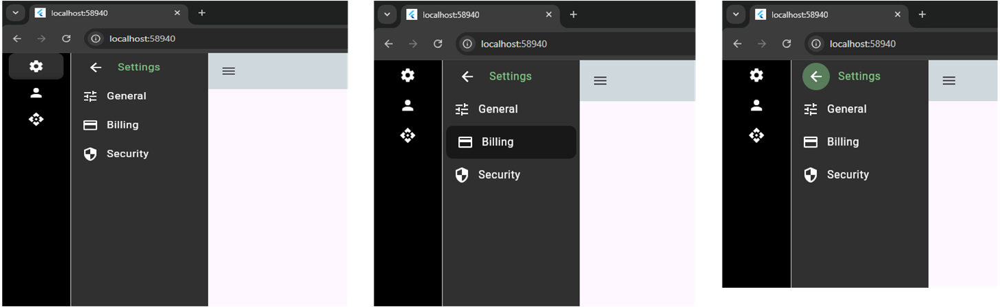
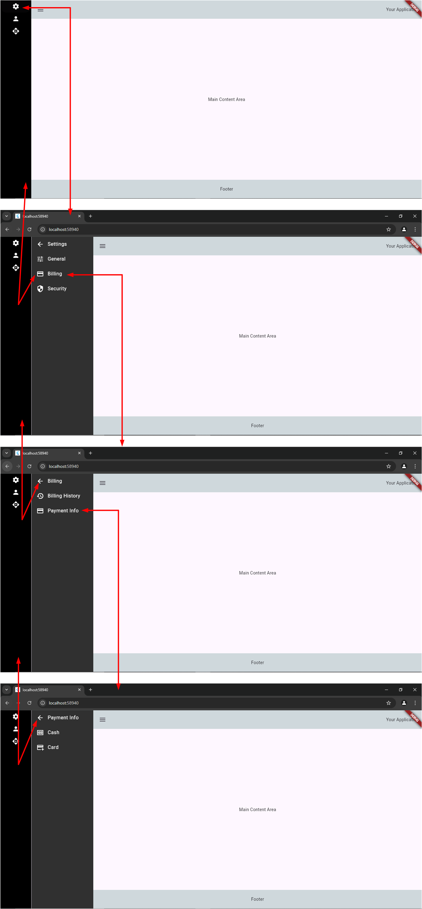
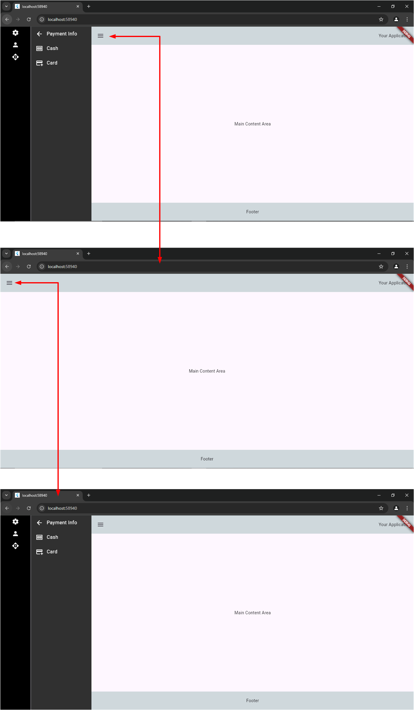

# flutter_web_side_menu_bar_1

A new Flutter project.

## Getting Started

This project is a starting point for a Flutter application.

A few resources to get you started if this is your first Flutter project:

- [Lab: Write your first Flutter app](https://docs.flutter.dev/get-started/codelab)
- [Cookbook: Useful Flutter samples](https://docs.flutter.dev/cookbook)

For help getting started with Flutter development, view the
[online documentation](https://docs.flutter.dev/), which offers tutorials,
samples, guidance on mobile development, and a full API reference.

Reference:
Dual-tier sidebar navigation — Untitled UI
https://dribbble.com/shots/21695263-Dual-tier-sidebar-navigation-Untitled-UI

https://dribbble.com/tags/side-menu

https://dribbble.com/shots/23324489-Sidebar-nav-Untitled-UI

https://dribbble.com/shots/21271774-Dual-tier-sidebar-navigation-Untitled-UI

https://dribbble.com/shots/20082889-Dual-tier-sidebar-navigation-Untitled-UI

UI details fro this Branch

